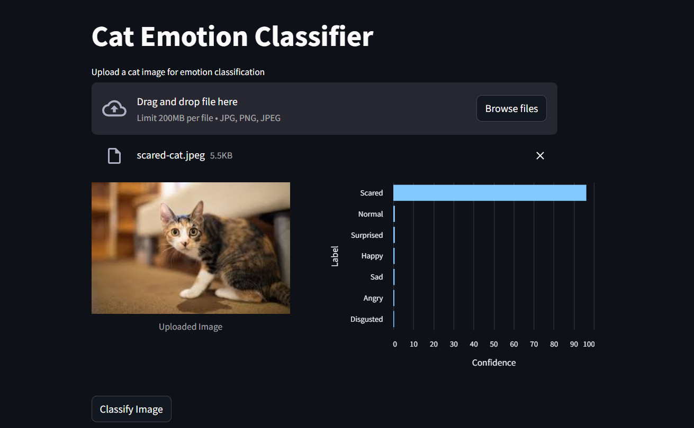

# Cat Emotion Classifier

This is a Streamlit application that classifies the emotions of cats from uploaded images using a Vision Transformer (ViT) model.

## Examples





## Features

- Upload an image of a cat and classify its emotion.
- Display the uploaded image.
- Show the classification results as a horizontal bar chart with confidence scores for each class.

## Installation

1. Clone the repository:

    ```sh
    git clone https://github.com/semihdervis/cat-emotion-classifier.git
    cd cat-emotion-classifier
    ```

2. Create a virtual environment and activate it:

    ```sh
    python -m venv venv
    source venv/bin/activate  # On Windows, use `venv\Scripts\activate`
    ```

3. Install the required dependencies:

    ```sh
    pip install -r requirements.txt
    ```

## Usage

1. Run the Streamlit app:

    ```sh
    streamlit run app.py
    ```

2. Open your web browser and go to `http://localhost:8501`.

3. Upload an image of a cat and click the "Classify Image" button to see the classification results.

## Model

The application uses a Vision Transformer (ViT) model fine-tuned for cat emotion classification, available on Hugging Face as [`semih-dervis/cat-emotion-classifier`](https://huggingface.co/semihdervis/cat-emotion-classifier).

## License

This project is licensed under the MIT License. See the [LICENSE](LICENSE) file for details.